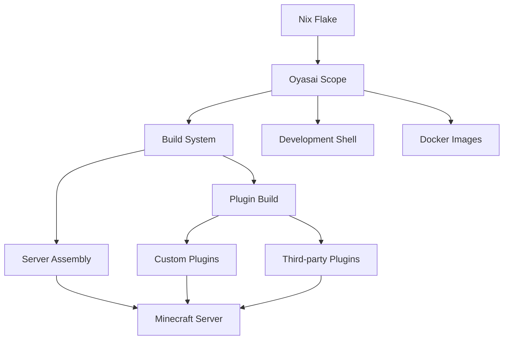

The Oyasai Server Platform is a modern, reproducible infrastructure for running a Minecraft server built with Nix flakes, Gradle, and Kotlin. The platform emphasizes declarative configuration, reproducible builds, and modular plugin development.

## Core Principles

The architecture is built on three foundational principles:

1. **Reproducibility**: Every build is deterministic and reproducible through Nix
2. **Modularity**: Plugins and packages are independently developed and composed
3. **Declarative Configuration**: Infrastructure and dependencies declared as code

## Technology Stack

<CardGroup cols={2}>
  <Card title="Nix Flakes" icon="snowflake">
    Manages dependencies, builds, and deployment with reproducible guarantees
  </Card>
  <Card title="Gradle 9" icon="cube">
    Builds Kotlin plugins with dependency management and multi-project support
  </Card>
  <Card title="Kotlin 2.3" icon="code">
    Primary language for plugin development on the JVM
  </Card>
  <Card title="Purpur 1.21.8" icon="server">
    High-performance Minecraft server implementation
  </Card>
</CardGroup>

## System Architecture

The platform follows a layered architecture:



## Key Components

### Flake Architecture

The root `flake.nix` orchestrates the entire build system:

```nix
{
  inputs = {
    nixpkgs.url = "github:nixos/nixpkgs/nixos-25.11";
    gradle2nix.url = "github:oyasaiserver/gradle2nix?ref=v2";
    flake-parts.url = "github:hercules-ci/flake-parts";
    # ... additional inputs
  };
}
```

The flake imports modular Nix configurations:

- `nix/oyasai-scope.nix` - Custom package scope and build logic
- `nix/devshells.nix` - Development environment configuration
- `nix/docker.nix` - Container image generation
- `nix/treefmt.nix` - Code formatting rules

### Oyasai Scope

The Oyasai scope (`nix/oyasai-scope.nix`) defines a custom package set with:

- **Java toolchain**: Temurin JDK/JRE 25
- **Build tools**: Gradle 9, gradle2nix
- **Plugin builders**: Batch compilation of all plugins
- **Server packages**: Multiple server configurations (main, minimal, marzipan)
- **Docker support**: Layered image builder

<Tip>
The scope uses `lib.makeScope` to create an isolated package namespace, preventing conflicts with nixpkgs.
</Tip>

### Plugin Build System

Plugins are built in batch mode for efficiency:

```nix
plugins-batch = scopeSelf.gradle2nix.buildGradlePackage {
  pname = "plugins";
  version = "0.0.0";
  src = /* filtered source tree */;
  gradleBuildFlags = [ "build" ];
  installPhase = ''
    mkdir -p $out
    cp plugins/*/build/libs/*.jar $out
  '';
};
```

Individual plugins are then extracted as separate derivations:

```nix
plugins = lib.mapAttrs' (name: _:
  lib.nameValuePair (lib.toLower name) (
    pkgs.runCommand name { } ''
      mkdir -p $out
      cp ${plugins-batch}/${name}.jar $out
    ''
  )
) (builtins.readDir ../plugins);
```

## Build Pipeline

The build process follows this flow:

1. **Dependency Resolution**: gradle2nix locks all Maven dependencies
2. **Plugin Compilation**: All plugins built together via Gradle
3. **Server Assembly**: Purpur server + plugins wrapped with runtime config
4. **Docker Packaging**: Layered images built for deployment

<Steps>
  <Step title="Lock Dependencies">
    Run `gradle2nix` to generate `gradle.lock` from Gradle dependencies
  </Step>
  <Step title="Build Plugins">
    Nix builds all plugins in a hermetic environment using the lock file
  </Step>
  <Step title="Assemble Server">
    `oyasaiPurpur` function combines server JAR with selected plugins
  </Step>
  <Step title="Create Docker Image">
    Docker builder creates layered images with the server package
  </Step>
</Steps>

## Package Outputs

The flake exposes these packages:

<AccordionGroup>
  <Accordion title="oyasai-minecraft-main">
    Production server with full plugin set including EssentialsX, LuckPerms, Vault, and custom plugins
  </Accordion>
  <Accordion title="oyasai-minecraft-minimal">
    Minimal server configuration for testing
  </Accordion>
  <Accordion title="oyasai-minecraft-marzipan">
    Specialized server configuration for specific use cases
  </Accordion>
  <Accordion title="oyasai-plugin-registry">
    Centralized registry of third-party plugins with version management
  </Accordion>
  <Accordion title="oyasai-push-nix-images">
    Utility for pushing Docker images to registries
  </Accordion>
</AccordionGroup>

## Development Environment

The development shell provides:

```nix
devshells.default = {
  packages = [
    nodejs    # Node.js 24 for tooling
    jdk       # Temurin JDK 25
    terraform # Infrastructure as code
    gradle    # Gradle 9 build tool
    gradle2nix-cli # Dependency locking
  ];
};
```

Enter the development environment:

```bash
nix develop
```

## Docker Integration

Docker images are built with layering for efficient caching:

```nix
passthru.docker = oyasaiDockerTools.buildLayeredImage {
  inherit name;
  config.Cmd = [ "${lib.getExe final}" ];
};
```

Images are automatically generated for:
- All server packages
- MariaDB database
- Backup utilities

## Related Documentation

<CardGroup cols={2}>
  <Card title="Monorepo Structure" icon="folder-tree" href="/architecture/monorepo-structure">
    Explore the project layout and organization
  </Card>
  <Card title="Nix Flakes" icon="snowflake" href="/architecture/nix-flakes">
    Deep dive into the Nix flake system
  </Card>
  <Card title="Plugin System" icon="puzzle-piece" href="/architecture/plugin-system">
    Learn how plugins are developed and built
  </Card>
</CardGroup>